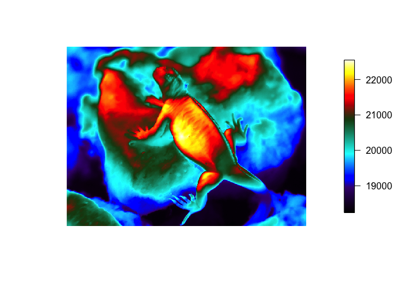
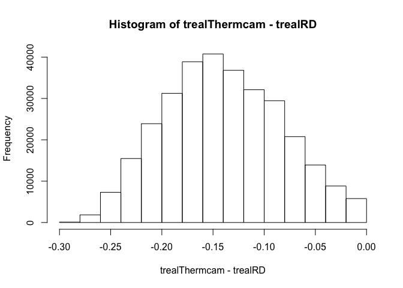
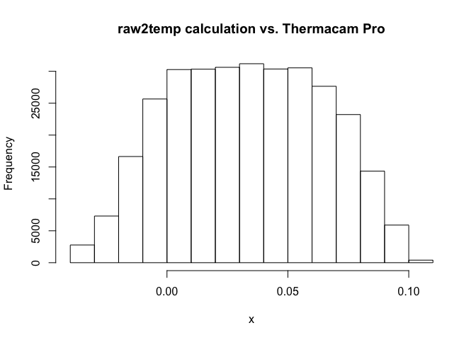
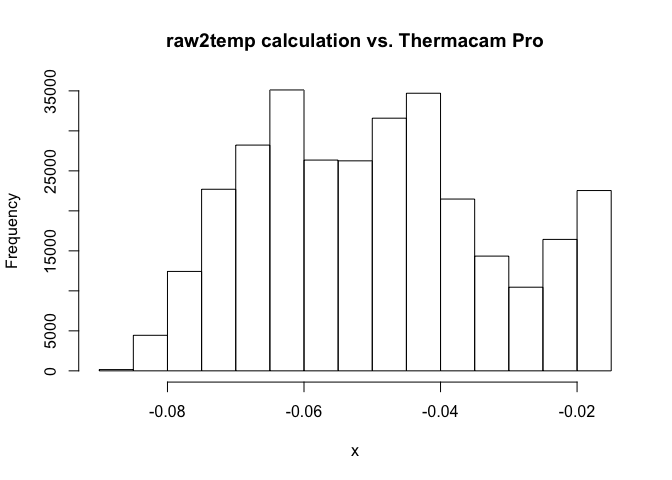
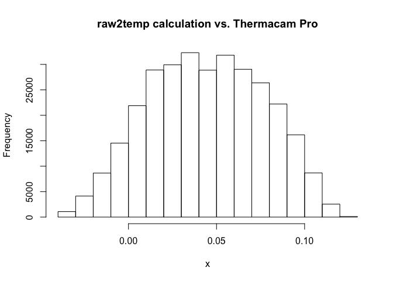
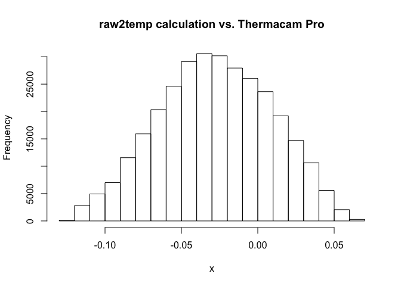
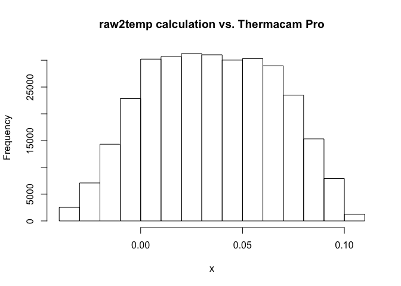
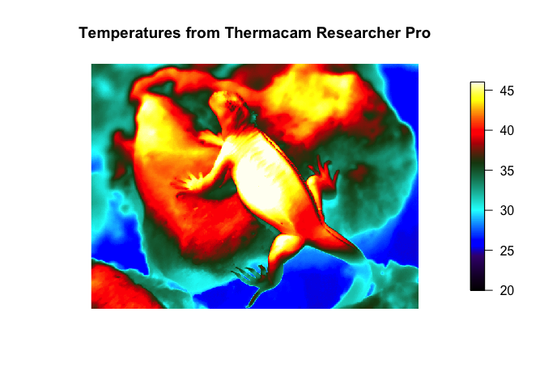
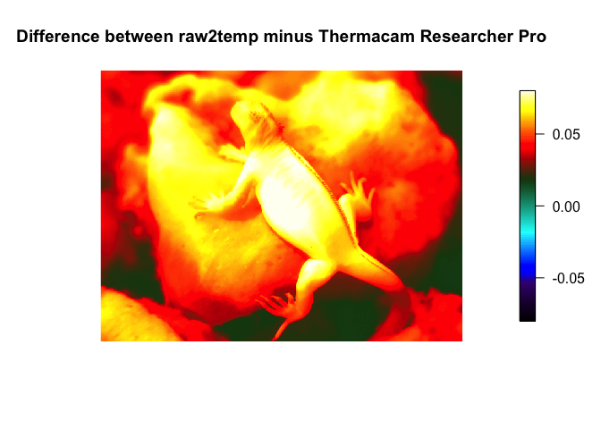

Thermimage: Calculation Checks
================

### Check Thermimage calculations against FLIR Researcher Max output

The purpose of this script is to compare Thermimage's raw2temp() conversion calculations in the Thermimage package against the standard values generated from numerous FLIR software programs

### Load in thermal image

``` r
library(Thermimage)
thermal.palette<-"rainbow1234pal"  # can choose form "flir","ironbow", "rainbow1234pal"

f<-"IguanaImageData/IguanaImage.JPG"
img<-readflirJPG(f, exiftoolpath="installed")
dim(img)
```

    ## [1] 480 640

``` r
plotTherm(img, h=480, w=640, thermal.palette=rainbow1234pal, minrangeset=min(img), maxrangeset=max(img), trans="rotate270.matrix")
```



The plot above is simply the raw binary radiance values imported. The scale should be in raw units where max possible = 2^16=65535 corresponding to the data storage method from FLIR jpgs)

We will calculate temperature below and compare to FLIR calculations, after extracting the calibration constants from the original flir jpg:

``` r
f<-"IguanaImageData/IguanaImage.JPG"
plancks<-flirsettings(f, exiftoolpath="installed", camvals="-*Planck*")
unlist(plancks$Info)
```

    ##      PlanckR1       PlanckB       PlanckF       PlanckO      PlanckR2 
    ##  2.110677e+04  1.501000e+03  1.000000e+00 -7.340000e+03  1.254526e-02

### Import Raw Thermal Image Data

I took the thermal image above and loaded it into FLIR's Research R&D and FLIR's ExaminIR software. Some FLIR programs allow you to export the raw binary data (FLIR R&D Software, ExaminIR), so I exported both to .csv files, and load both files into r1 and r2 (i.e., raw values 1, real values 2):

``` r
r1<-as.matrix(read.csv("IguanaImageData/IguanaRawR&D.csv", header=FALSE))
r2<-as.matrix(read.csv("IguanaImageData/IguanaRawExaminIR.csv", header=FALSE))
r1[1:5, 1:5] # show a 5x5 array of pixel values from r1
```

    ##         V1    V2    V3    V4    V5
    ## [1,] 19852 19867 19838 19835 19839
    ## [2,] 19848 19831 19842 19820 19812
    ## [3,] 19832 19807 19826 19824 19815
    ## [4,] 19824 19799 19813 19802 19805
    ## [5,] 19796 19800 19775 19800 19792

``` r
r2[1:5, 1:5] # show a 5x5 array of pixel values from r2 - looks the same as above
```

    ##         V1    V2    V3    V4    V5
    ## [1,] 19852 19867 19838 19835 19839
    ## [2,] 19848 19831 19842 19820 19812
    ## [3,] 19832 19807 19826 19824 19815
    ## [4,] 19824 19799 19813 19802 19805
    ## [5,] 19796 19800 19775 19800 19792

``` r
mean(r1-r2)  # it is the same as above!
```

    ## [1] 0

Since the mean value of if mean = 0 then both software outputs are using the same raw data. That's expected. However, FLIR is continually creating new software and often with very little difference in practical functionality to the researcher, but at great expense to a research budget, so it behoves to ask. Since there is little open disclosure of calculations between these software packages, does it matter which software to use in terms of temperature estimates?

### Do all FLIR Programs Perform the Same Calculations?

Below, I load in 3 files that represent the same image set to realistic emissivity and environmental values, calculated within each program (Thermacam Researcher Pro v2.9, ExaminIR, and Flir Research R&D Max), and compare mean values (across all 307200 pixels):

``` r
trealThermcam<-as.matrix(read.csv("IguanaImageData/IguanaActualTemperatureE0.96Temps20Thermcam.csv", header=FALSE)) 
# trealThermacam = the real temperature calculated from Thermacam Researcher Pro.
trealExamIR<-as.matrix(read.csv("IguanaImageData/IguanaActualTemperatureE0.96Temps20ExaminIR.csv", header=FALSE))
trealRD<-as.matrix(read.csv("IguanaImageData/IguanaActualTemperatureE0.96Temps20R&D.csv", header=FALSE, sep=";"))

mean(trealThermcam-trealExamIR) # -0.0786 oC difference
```

    ## [1] -0.07869341

``` r
mean(trealThermcam-trealRD)     # -0.1396 oC difference
```

    ## [1] -0.139604

``` r
mean(trealExamIR-trealRD)       # -0.0609 oC difference
```

    ## [1] -0.06091061

``` r
hist(trealThermcam-trealRD)
```

 So 3 programs by FLIR that open the same image and have camera settings set to the same values, lead to to estimated temperatures that differ by 0.07 to 0.13 degrees C! The largest difference of -0.14 is between Thermacam Researcher Pro vs Research R&D Max. Some differences are as much as -0.25 degrees C. Presumably the algorithm has changed with the more recent software (R&D Max)?

But no explanation is provided for this, and this is the challenge of working with proprietary, non open source software. But these differences are fairly small, so perhaps we can ignore them. It does suggest caution, however in assuming all software is operating on the same principles.

### Change the Export Settings from FLIR Software

Here, the same image (IguanaImage.jpg) was analysed in Thermacam Researcher Pro but the settings changed on purpose and the temperature data exported to csv files. Below I added a less transmissive window, or I heated the window up, or I used a lower emissivity for the object (but kept the window transmittance = 1)

``` r
tt0.9<-as.matrix(read.csv("IguanaImageData/Iguana_T0.9.csv", header=FALSE)) # transmission window = 0.9
tt0.7<-as.matrix(read.csv("IguanaImageData/Iguana_T0.7.csv", header=FALSE)) # transmission window = 0.7
trt40<-as.matrix(read.csv("IguanaImageData/Iguana_RT40.csv", header=FALSE)) # transmission window = 1, but the window temperature was set to 40C 
te0.9<-as.matrix(read.csv("IguanaImageData/Iguana_E0.9.csv", header=FALSE)) # Emissivity = 0.9
```

clearly, changing parameters will distort estimates of temperature, but this is to be expected:

``` r
mean(tt0.9-trealThermcam)  # 1.549 oC
```

    ## [1] 1.549309

``` r
mean(tt0.7-trealThermcam)  # 5.527 oC
```

    ## [1] 5.527175

``` r
mean(trt40-trealThermcam)  # -0.95 oC
```

    ## [1] -0.9528988

``` r
mean(te0.9-trealThermcam)  # 0.88 oC
```

    ## [1] 0.8807861

All of which drives home the point of setting parameters properly to ensure accurate results.

Recall the calibration parameters, they will be used in the calculations below:

``` r
unlist(flirsettings("IguanaImageData/IguanaImage.jpg", camvals="-*Planck*")$Info)
```

    ##      PlanckR1       PlanckB       PlanckF       PlanckO      PlanckR2 
    ##  2.110677e+04  1.501000e+03  1.000000e+00 -7.340000e+03  1.254526e-02

### Compare Thermimage raw2temp() calculations to FLIR Software

Create 5 potential calculations of the IguanaImage.jpg data by changing key parameters used in the estimation of temperature:

``` r
trealc<-raw2temp(r1, E=0.96, OD=1, RTemp=20, ATemp=20, IRT=1, RH=50,PR1 = 21106.77, PB = 1501, PF = 1, PO = -7340, PR2 = 0.012545258)
tt0.9c<-raw2temp(r1, E=0.96, OD=1, RTemp=20, ATemp=20, IRT=0.9, RH=50, PR1 = 21106.77, PB = 1501, PF = 1, PO = -7340, PR2 = 0.012545258)
tt0.7c<-raw2temp(r1, E=0.96, OD=1, RTemp=20, ATemp=20, IRT=0.7, RH=50, PR1 = 21106.77, PB = 1501, PF = 1, PO = -7340, PR2 = 0.012545258)
trt40c<-raw2temp(r1, E=0.96, OD=1, RTemp=40, ATemp=40, IRWTemp=40, IRT=1, RH=50, PR1 = 21106.77, PB = 1501, PF = 1, PO = -7340, PR2 = 0.012545258)
te0.9c<-raw2temp(r1, E=0.9, OD=1, RTemp=20, ATemp=20, IRT=1, RH=50,PR1 = 21106.77, PB = 1501, PF = 1, PO = -7340, PR2 = 0.012545258)
```

Compare Thermimage calculated values to the same settings as exported from Thermacam Researcher Pro:

``` r
x<-trealc-trealThermcam
mean(x) # 0.033oC 
```

    ## [1] 0.03322015

``` r
hist(x, main="raw2temp calculation vs. Thermacam Pro")
```



``` r
x<-tt0.9c-tt0.9
mean(x) # -0.0497 oC
```

    ## [1] -0.04975892

``` r
hist(x,  main="raw2temp calculation vs. Thermacam Pro")
```



``` r
x<-tt0.7c-tt0.7
mean(x) # 0.044 oC
```

    ## [1] 0.04439957

``` r
hist(x,  main="raw2temp calculation vs. Thermacam Pro")
```



``` r
x<-trt40c-trt40
mean(x) # -0.028 oC
```

    ## [1] -0.02780422

``` r
hist(x,  main="raw2temp calculation vs. Thermacam Pro")
```



``` r
x<-te0.9c-te0.9
mean(x) # 0.035 oC
```

    ## [1] 0.03491885

``` r
hist(x, main="raw2temp calculation vs. Thermacam Pro")
```



For all the above, the difference between Thermimage calculated values and Thermacam Researcher Pro exported values is ~0.04 oC which happens to be the resolution of the thermal camera used (Model SC660).

Therefore, it appears that calculations in raw2temp() are working as intended.

### Finally a plot of the image used to make these comparisons:

``` r
plotTherm(tt0.9, h=480, w=640, minrangeset=20, maxrangeset=46, trans="rotate270.matrix",  main="Temperatures from Thermacam Researcher Pro", thermal.palette=rainbow1234pal)
```



``` r
plotTherm(tt0.9c, h=480, w=640,  minrangeset=20, maxrangeset=46, trans="rotate270.matrix", main="Temperatures from Thermimage's raw2temp function", thermal.palette=rainbow1234pal)
```


``` r
plotTherm(tt0.9-tt0.9c,h=480, w=640,  minrangeset=-0.08, maxrangeset=0.08, trans="rotate270.matrix", main="Difference between raw2temp minus Thermacam Researcher Pro", thermal.palette=rainbow1234pal)
```



### References

Holst, G. C. (2000). Common sense approach to thermal imaging. Bellingham, Wash & Winter Park, Fla.: SPIE Optical Engineering Press; JCD Publishing.

Minkina, W. and Dudzik, S. (2009). Infrared thermography errors and uncertainties, pp. xix, 192 p. Chichester, West Sussex, U.K. ; Hoboken, NJ: J. Wiley.

Tattersall, G. J. (2016). Infrared thermography: A non-invasive window into thermal physiology. Comp Biochem Physiol A Mol Integr Physiol 202, 78-98.

### Online Resources

EEVBlog:

-   raw to temperature conversion: <http://u88.n24.queensu.ca/exiftool/forum/index.php?topic=4898.135>
